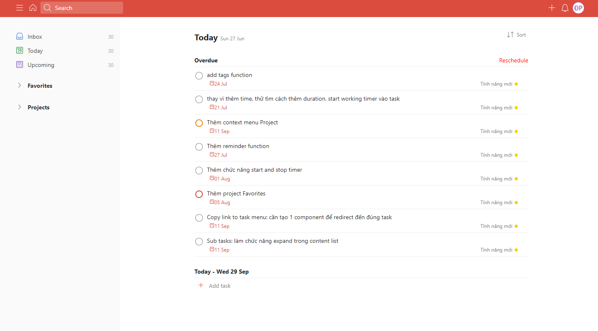
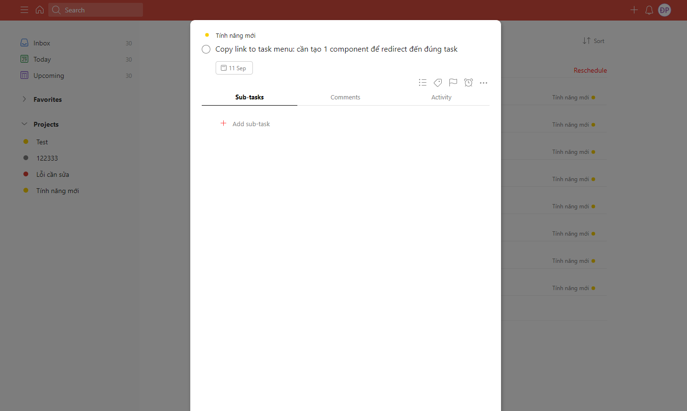
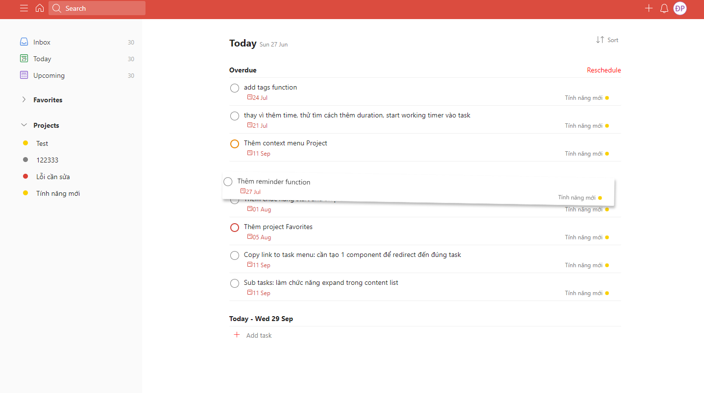
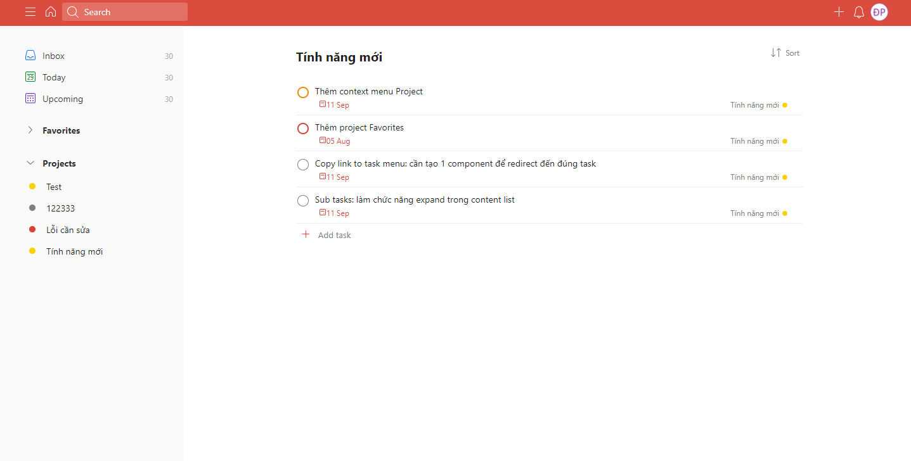

# Todoist clone React app

This project was bootstrapped with [Create React App](https://github.com/facebook/create-react-app).

## Screenshots

## Technologies used in this project

---

- ReactJS + [Redux toolkits](https://redux-toolkit.js.org/)

- Express Nodejs + MongoDB(mongoose)
- Styled components
- [React Beautiful Drag and drop](https://github.com/atlassian/react-beautiful-dnd)
- [React Infinity Calendar](https://github.com/clauderic/react-infinite-calendar)
- Axios,...

## Features

---

- **Create/Edit/Save, Mark as Done** Task.

- **Sub tasks** - Each Task can have multiple sup tasks.
- Set **Deadline, Priority and Drag Drop** to reorder Tasks.
- Both **Inline** and **Popup** edit Task function.
- **Project features** - can assign Tasks to a specific Project.

## Features on Plan

---

- **Time tracker** - to tracking time when you are doing on the Task. Stop it when you finished the Task, to see how many time used for the Task.
- **Timeline chart** - showing Time used by each Task in a calendar chart. [Example](https://files.planyway.com/common/powerup-store-project-roadmap.png)

- **Filter/Sort** Tasks.
- **Comment** in Task
- **User/Authentication**.
- **Kanban Board** style Project - like Trello, this feature existed in original Todoist.
- ......
